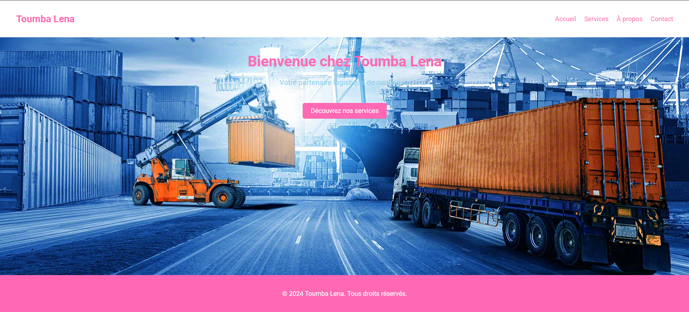

# Projet-Sass

Ce dépôt GitHub contient le code pour mon projet Sass, où j'ai développé un site web utilisant Sass pour la gestion des styles.

## Description

Dans ce projet, j'ai créé un site web nommé "Toumba Lena" qui met en avant une entreprise de logistique fictive. J'ai utilisé Sass pour organiser mes styles de manière modulaire et maintenable.

## Contenu du dépôt

- **index.html** : Le fichier HTML principal de la page d'accueil du site.
- **styles.scss** : Le fichier Sass où j'ai défini les styles pour le site.
- **script.js** : Le fichier JavaScript contenant les fonctionnalités interactives du site.
- **img/** : Le dossier contenant les images utilisées dans le site, y compris le fond.

## Instructions d'utilisation

1. Cloner ce dépôt sur votre machine locale.
2. Ouvrir le fichier `index.html` dans votre navigateur web pour visualiser le site.
3. Pour modifier les styles, éditer le fichier `styles.scss` et compiler en CSS à l'aide de votre préprocesseur Sass préféré.

## Aperçu

